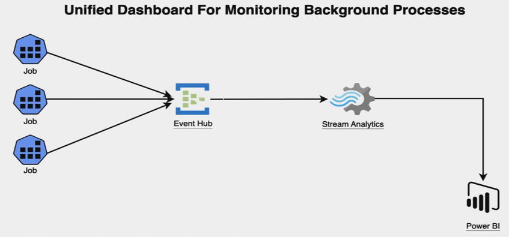

# Unified-Dashboard-For-Monitoring-Background-Processes

Creating a Unified Dashboard for all the background processes/ jobs where the real time status of any of the above background processes/ jobs can be monitored.

# What Are We Trying To Solve?

Today, organizations commonly face challenges in managing their automated background processes. some of the challenges include:

1. **Lack of Clear Visibility**: Organizations hugely rely on automated background processes and tasks. It creates a haphazard environment for them as they don’t have clear visibility on the details/statuses of the Job.
2. **Delayed issue detection**: Many problems/issues go undetected until they cause noticeable disruptions in the system functionality / performance.
3. **Applications impacted**: with low and slow performance.
4. **Job Failure**: Unmonitored Jobs may fail silently which can lead to inconsistent data / lost data.
5. **User Experience** is Impacted. 
6. **Maintenance Challenges** overtime. 

## Solution 

The solution comprises four distinct steps:
1. **Job Overview**: Offer a comprehensive overview of scheduled jobs at a glance showcasing their current statuses, which encompass "In Progress," "Completed," "Yet to Start," and "Failed."
2. **Real time Status**: Real time - Progress bars to illustrate the Job Statistics like how far along the job is in duration.
3. **Job Details**: Section for Job details & logs, that provides detailed information about each Job – Job name, Job ID, Start time, End time, duration, error messages or relevant log.
4. **Seamless Connectivity**: Enable uninterrupted and seamless data connectivity without any conflicts or interruptions.

## Solution Components
 
 **Tech Stack**: Azure Event Hubs, Stream Analytics, Power BI

## Architecture

